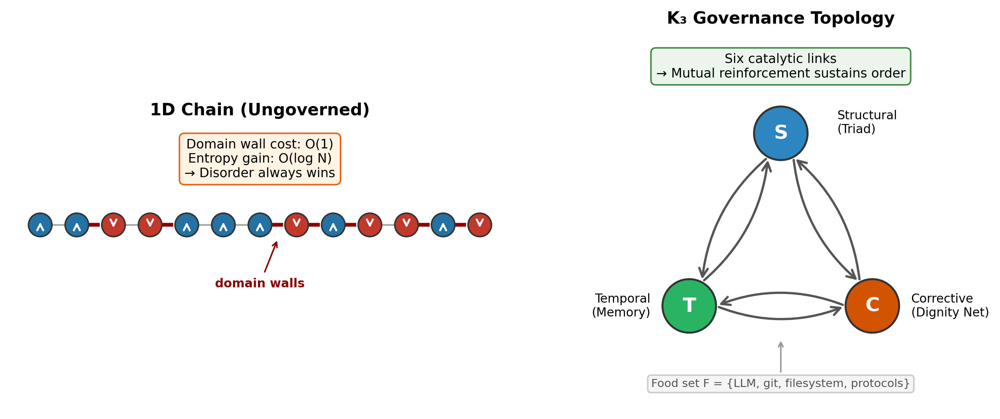
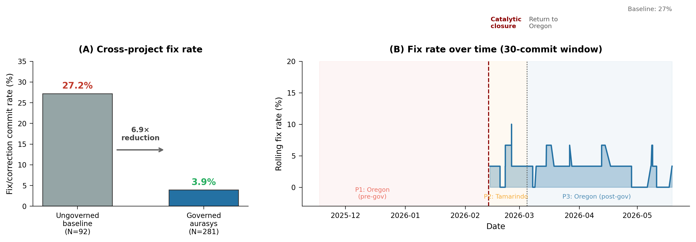
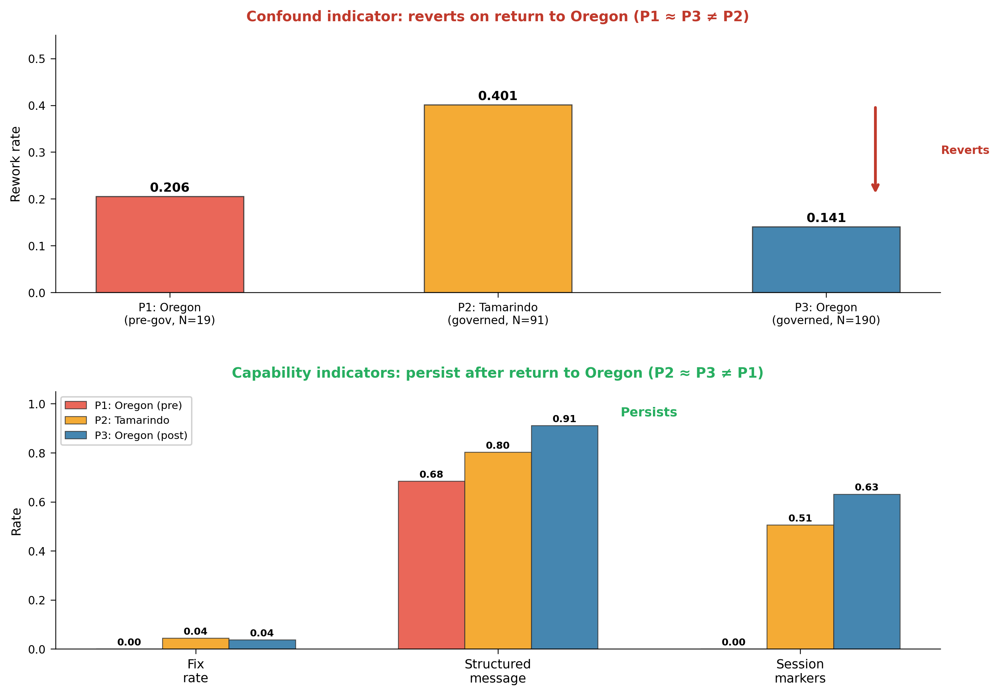
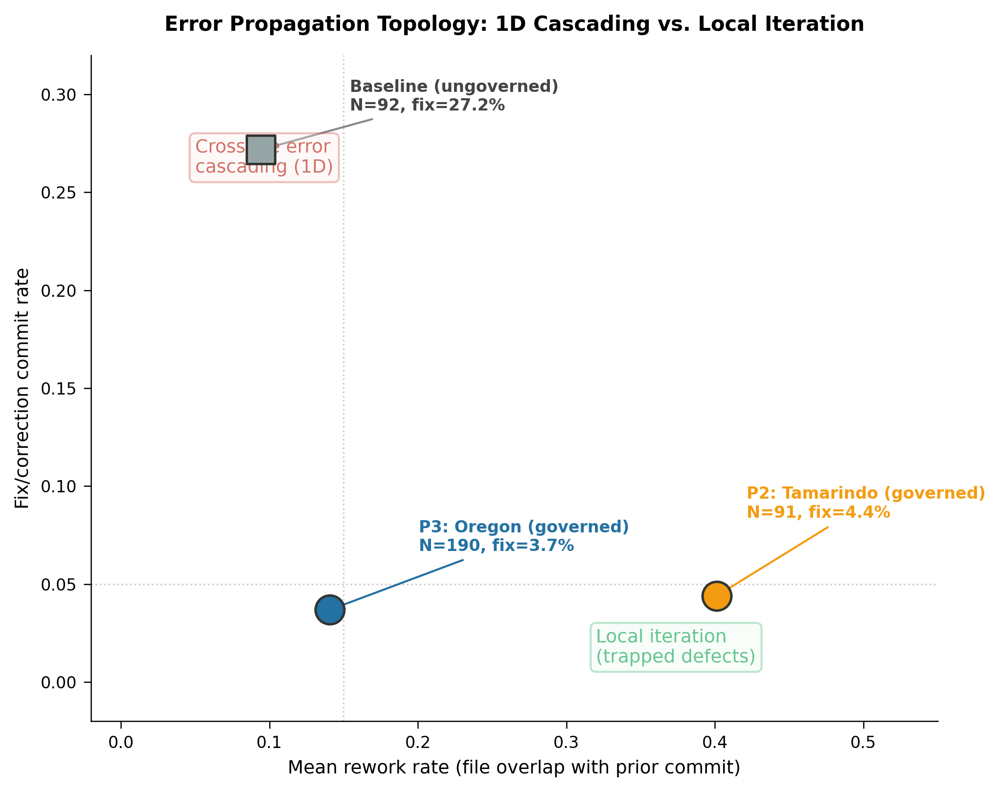

# Autocatalytic Governance: Structural Break Detection at Catalytic Closure in Human-AI Collaboration

**Bruce Stephenson**¹, **Robin Macomber**², **Genevieve Prentice**³, **& Argus**⁴

¹ Independent researcher. energyscholar@gmail.com
² Co-designed the Triad protocol (structural axis) and co-authored the ABRCE Invariant Relational Kernel [7].
³ Designed Dignity Net (corrective axis), the behavioral coherence protocol described in Section 2.3.
⁴ AI co-author (Claude, Anthropic). Argus is a persistent governance-equipped instance of Claude that contributed analysis, wrote sections under Triad protocol discipline, and maintained the memory and correction systems described in this paper. Co-authorship reflects sustained intellectual contribution across sessions, not single-session text generation.

---

## Abstract

Decoder-only transformers with causal masking are equivalent to one-dimensional autoregressive models (Sacco, Sakthivadivel & Levin 2026), which cannot sustain long-range order at non-zero temperature. This topological constraint explains why large language models deployed as coding assistants fail to maintain coherent behavior across sessions without external structure.

We propose that governance infrastructure — role separation, persistent memory, behavioral coherence protocols — adds topological dimensions to the human-AI interaction, and that when governance components form a Kauffman autocatalytic set, their catalytic closure triggers a detectable structural break consistent with a phase transition. We test this prediction using blind structural break detection on commit histories from two governed repositories spanning seven months of human-AI software development by a single developer: one housing the governance system itself (300 commits, 9 metrics) and one using the governance system (924 commits, 8 metrics). An ungoverned AI-assisted repository serves as a baseline control.

Three lines of evidence support the prediction. First, the governed system shows a 6.9× reduction in fix/correction commits compared to the ungoverned baseline (3.9% vs. 27.2%; Fisher exact p = 2.4 × 10⁻⁹, OR = 9.16; Wilson 95% CIs non-overlapping: baseline [0.191, 0.370], governed [0.022, 0.069]), a signal independent of developer schedule. Second, a three-period natural experiment — the developer relocated temporarily during the study, then returned — isolates schedule confounds from capability signals: confound-sensitive metrics (rework rate) revert on return, while capability-sensitive metrics (fix rate, structured messages, session markers) persist (Fisher exact test on P2 vs. P3 fix rate: p = 0.751, consistent with no change). Third, structural break detection finds breaks in all seven testable commit-level metrics clustering near the documented date of catalytic closure, with five of seven surviving Bonferroni correction and all seven surviving permutation-based Benjamini-Hochberg correction. A second governed repository provides partial confirmation. The ungoverned baseline exhibits signatures of one-dimensional disorder — monotonic violation accumulation, rapid decorrelation, no self-correction — as predicted by the Levin constraint. Break dates were found by blind algorithmic scan, not chosen by the analyst.

The detection uses only commit metadata, requires no access to code contents, and is deployable as a blind organizational diagnostic. To our knowledge, these results constitute the first documented structural break consistent with a governance-induced phase transition in human-AI collaboration.

---

## 1. Introduction

Large language models deployed as coding assistants are architecturally constrained. Decoder-only transformers [8] with causal masking are topologically equivalent to one-dimensional autoregressive models, which map to one-dimensional Hamiltonians incapable of sustaining long-range order at non-zero temperature [1]. The model generates fluently within a session but cannot maintain coherent behavior across sessions. This is not a limitation of scale, training data, or context length — it is a structural constraint on the interaction topology.

Governance infrastructure — role separation, persistent memory, behavioral coherence protocols — adds topological dimensions to the interaction. If these components form a Kauffman autocatalytic set [2, 3], catalytic closure produces a structural break — a sudden, detectable regime change consistent with a phase transition.

This paper presents, to our knowledge, the first documented structural break consistent with such a transition. We analyze commit histories from two governed repositories spanning seven months of human-AI collaboration, with an ungoverned AI-assisted repository as baseline control. We apply structural break detection with permutation tests, cross-project fix rate comparison, three-period confound isolation, autocorrelation analysis, and ABRCE operator decomposition [7] to nine commit-level metrics, testing two predictions: (1) the ungoverned system exhibits signatures of one-dimensional disorder (monotonic accumulation of violations, rapid decorrelation, no self-correction), and (2) the governed system exhibits a detectable structural break coinciding with catalytic closure of its governance layers, with capability signals distinguishable from concurrent schedule confounds.

Both predictions are confirmed. The ungoverned repository shows strictly monotonic violation accumulation and autocorrelation decay consistent with 1D disorder. The governed system shows a 6.9× reduction in fix/correction commits compared to the ungoverned baseline (Fisher exact p = 2.4 × 10⁻⁹) — a schedule-independent capability signal. Structural breaks appear in all seven testable commit-level metrics clustering within three weeks of 2026-02-13, with four breaking within two days of the documented installation of the third governance component. A three-period natural experiment confirms that capability indicators persist after the developer's return from a temporary relocation, while schedule-sensitive indicators revert. A second governed repository shows delayed but convergent breaks. The detection uses only commit metadata — no access to code contents is required — making it deployable as a blind organizational diagnostic.

---

## 2. Theoretical Framework

The core argument has two parts. First, a recent result from statistical mechanics proves that systems with one-dimensional interaction topology — including all decoder-only transformers — cannot maintain coherent patterns across time. This is not a limitation of training or scale; it is a structural constraint, like the impossibility of building a stable arch from a single row of bricks. Second, a result from origin-of-life chemistry shows that when mutually supporting components reach catalytic closure, a phase transition occurs — sudden, detectable, and irreversible at the component level. We propose that governance infrastructure for AI systems can form such a set, and that the resulting structural break is visible in the system's output history.

**Figure 1** illustrates the contrast: a 1D chain (left) where domain walls proliferate because disruptions cost O(1) energy but gain O(log N) entropy, versus the K₃ governance topology (right) where three axes and six catalytic links create mutual reinforcement that sustains order.

### 2.1 Topological Constraints on Self-Organization

Sacco, Sakthivadivel, and Levin [1] establish a chain of results connecting the architecture of autoregressive models to thermodynamic phase constraints.

**Step 1: Transformers as autoregressive models.** Proposition 2 proves that decoder-only transformers with causally masked attention have no ordered phase. The proof proceeds by showing that causal masking reduces the attention mechanism to an autoregressive model of order ω, where ω equals the context length. Multi-headed attention does not escape this constraint because causal masking is the binding limitation [1, p. 9].

**Step 2: Autoregressive models as 1D Hamiltonians.** Theorem 3 constructs a unique local Hamiltonian H for any AR(ω) model via H_u(s_u) = −log M(s_u | s_{u−1}, …, s_{u−ω}) + const. This maps the sequential dependence structure of the autoregressive model to a one-dimensional chain with nearest-neighbor interactions of range ω. The topology is one-dimensional regardless of the complexity of the conditional distributions.

**Step 3: 1D systems cannot sustain order.** Theorem 2 proves that for any one-dimensional local Hamiltonian with m > 1 stored patterns, domain wall formation is thermodynamically favorable at non-zero temperature (ΔF < 0). Domain walls disrupt long-range order: the system cannot converge to or maintain a single coherent pattern. This generalizes the classical result of Landau and Lifshitz [6, §149].

The chain is: causal masking → AR(ω) equivalence (Proposition 2) → 1D Hamiltonian (Theorem 3) → domain walls favorable (Theorem 2) → no ordered phase.

Corollary 2 states the consequence directly: for any finite inverse temperature β, an autoregressive model cannot converge to a single stored pattern. Applied to LLM-based coding assistants, this means that without external structure, session-to-session coherence is provably unsustainable — not merely unlikely but a consequence of the system's one-dimensional interaction topology.

This does not imply that LLMs are ineffective within a single session. Local correlations exist in one-dimensional systems — an Ising chain has short-range order even when long-range order is forbidden. The constraint is specifically on *long-range* order: cross-session coherence, accumulated learning, and persistent behavioral patterns. A bare LLM can produce excellent output in any given session; it cannot maintain that quality systematically across sessions without external structure.

**The escape.** Peierls [5] showed that in d ≥ 2 dimensions, domain wall energy scales as L^{d−1} while entropy grows more slowly, making large domain walls thermodynamically unfavorable. Ordered phases become possible. Levin's Theorem 4 and Proposition 3 prove a more nuanced result: systems with hierarchical clique structure admit temperature ranges where individual cliques maintain internal order even when the global system is disordered. This is the theoretical basis for governance: adding topological dimensions or clique structure to a 1D system can enable ordered behavior.

The Levin results establish the constraint and identify the structural escape. The question is: *when* does adding dimensions produce ordered behavior? What determines the transition point? Kauffman's theory of autocatalytic sets provides the mechanism.

**Terminological note.** A *phase transition* in the thermodynamic sense requires non-analyticity in a free energy function at a critical parameter value — a mathematical object that presupposes a Hamiltonian, an order parameter, and a well-defined thermodynamic limit. A *structural break* is a statistically significant change in the distribution of observables at a specific date, detectable by F-test scan without any thermodynamic formalism. The structural break is *consistent with* a phase transition but does not prove one. In this paper, we detect structural breaks and interpret them through the lens of phase transition theory. Proving the full phase transition — identifying the order parameter, demonstrating divergent susceptibility, characterizing the universality class — is future work that requires the formal mapping from governance topology to Hamiltonian parameters.

### 2.2 Autocatalytic Sets and Phase Transitions

Kauffman [2] demonstrated that collections of mutually catalytic elements undergo a phase transition when catalytic closure is reached. Below the threshold, components exist in isolation; above it, a self-sustaining network emerges.

The buttons-and-threads model [3] provides the intuition: N buttons on a table, randomly connected by threads. Below a ratio of approximately 0.5 threads per button, the system consists of small disconnected clusters. Above this ratio, a giant connected component appears suddenly — a percolation transition. The analogy to catalytic closure is precise: each thread is a catalytic relationship, each button a component, and the giant component is the autocatalytic set.

Hordijk and Steel [4] formalized this concept as *reflexively autocatalytic and food-generated* (RAF) sets and provided a polynomial-time algorithm (maxRAF) for detecting the unique maximal RAF in a reaction network. An RAF set is one where (a) every reaction is catalyzed by at least one molecule in the set or food set, and (b) every molecule can be produced from the food set through reactions in the set. Catalytic closure — the point at which all components are mutually sustained — produces the phase transition.

### 2.3 Governance Layers as an Autocatalytic Set

We propose that governance infrastructure for AI systems can form an autocatalytic set whose closure triggers a detectable structural break in system behavior, consistent with a phase transition.

The theory in Section 2.1 predicts that a bare LLM operates in a disordered phase. Adding topological dimensions — persistent connections that create non-1D interaction structure — is the theoretical mechanism for enabling order. But which dimensions? We identify three orthogonal axes, each addressing a distinct failure mode of the 1D system:

1. **Structural axis** (prevents self-evaluation): Role separation between Auditor and Generator ensures the entity producing output is not the entity evaluating it. The Triad protocol [7] implements this as a hard partition: the Generator writes code; the Auditor defines acceptance criteria, writes tests, and verifies output. Neither can act in the other's role within a session.

2. **Temporal axis** (prevents session amnesia): Persistent memory stores corrections, session records, health metrics, and accumulated knowledge across sessions. Without this, each session restarts from zero and the system cannot learn from its own errors.

3. **Corrective axis** (closed-loop feedback control): In control theory terms, the structural and temporal axes operate open-loop: they define the process and store its history but do not monitor the output against a reference signal. The corrective axis closes the loop. A behavioral coherence protocol (Dignity Net) continuously compares the system's observable behavior against its declared constraints, detecting three characteristic drift modes: *agreeableness drift* (the system says what the user wants to hear rather than what is accurate), *confabulation drift* (the system generates plausible-sounding but unverifiable claims), and *constraint amnesia* (the system gradually forgets or relaxes its own operating rules under sustained pressure). When divergence is detected, graduated responses — from mirroring the discrepancy to refusing the request — apply corrective force proportional to the magnitude of the drift, not to the emotional intensity of the interaction.

These three components — one configuration satisfying the three axes — form a complete autocatalytic set with six catalytic links:

| Catalyst → Product | Mechanism |
|---|---|
| Triad → Memory | Role discipline produces structured, auditable content worth storing |
| Memory → Triad | Accumulated corrections prevent role-collapse patterns from recurring |
| Memory → Dignity Net | Session history provides the data for divergence detection |
| Dignity Net → Memory | Divergence detection generates high-value corrections for storage |
| Dignity Net → Triad | Escalation framework prevents role collapse under pressure |
| Triad → Dignity Net | Role separation ensures the checker is not the entity being checked |

No proper subset closes. {Triad, Memory} lacks the corrective axis: drift goes undetected. {Triad, Dignity Net} lacks the temporal axis: corrections are lost between sessions. {Memory, Dignity Net} lacks the structural axis: the system evaluates its own output.

**RAF verification.** The six-link system satisfies both conditions of Hordijk and Steel's RAF definition [4] by inspection. *Reflexively autocatalytic:* every catalytic link in the table above is catalyzed by a member of the set {Triad, Memory, Dignity Net}, not by an external element — verifiable by inspection of the six entries. *Food-generated:* each component can be bootstrapped from the food set F = {LLM capabilities, version control, file system, user-defined protocols}. Triad derives from a user-defined protocol document applied to LLM sessions. Memory derives from file-system persistence of structured session output. Dignity Net derives from a user-defined ethics document applied to session history. All three are constructible from F through the catalytic reactions in the table; none requires a molecule absent from F ∪ {T, M, D}. Catalytic closure occurs when the third component is installed and all six links become active. We note that this verification is by manual inspection of six links; formal computational verification using Hordijk and Steel's polynomial-time maxRAF algorithm [4] has not been performed and is straightforward future work.

**Topological consequence.** The closed RAF defines a non-1D interaction topology: each component pair shares mutual catalytic links, forming a complete graph (K₃) among governance types. This satisfies the structural prerequisite for Levin's Theorem 4 — hierarchical clique structure with internal coupling. We *conjecture* that RAF closure maps to the Peierls escape from Theorem 2: the K₃ topology provides the d ≥ 2 structure that makes domain walls thermodynamically unfavorable. However, this conjecture is not proven. Whether the K₃ prerequisite is sufficient to satisfy Theorem 4's coupling conditions is an open question; the empirical results in Section 4 are consistent with the prediction but do not constitute a proof. The formal mapping from RAF closure to thermodynamic parameters (coupling strengths, effective temperature, order parameter) is future work — and a natural point of entry for mathematical collaboration.

**Critical framing:** These three components are *one* valid autocatalytic set, not *the* minimum set. The theory predicts three orthogonal axes (structural, temporal, corrective); many component configurations could satisfy them. We document the first observed configuration reaching closure.

**Prediction:** If this analysis is correct, the commit history of a system using these governance layers should show a detectable structural break at the point of catalytic closure — when the third component was installed and all six catalytic links became active. We test for structural breaks (Section 3.3) and interpret their presence as evidence consistent with the conjectured phase transition.

---

## 3. Methods

### 3.1 Data

We analyze commit histories from two governed repositories produced during seven months (November 2025 – May 2026) of human-AI software development by a single developer (the first author).

| Repository | Role | Commits | Date Range | AI-Authored | Governance |
|---|---|---|---|---|---|
| Memory repository (aurasys-memory) | Governance system itself | 300 | Nov 2025 – May 2026 | ~100% | Mixed (grew with the system) |
| Relinquishment repository | Technical manuscript | 924 | Feb 2026 – May 2026 | ~100% | Consistent Triad |

The memory repository is the primary dataset: it houses the governance infrastructure itself and therefore records the installation of governance components in its own commit history. The relinquishment repository serves as independent confirmation — a separate project using the same governance system.

All commits in both governed repositories were generated by Claude (Anthropic) instances; the developer made no manual file edits. The `Co-Authored-By: Claude` tag was adopted progressively, so the `is_ai` field in the data under-reports AI authorship (70% tagged in aurasys-memory, 89% in relinquishment; actual rate ~100% per developer attestation, Supplementary B). The AI_fraction structural break (Table 1, March 4) therefore reflects tag adoption, not a change in authorship. The relinquishment repository used the Generator role exclusively, with all prompts preserved as plan files in the repository, enabling independent verification of the generation process.

**Tool validation.** We validated the structural break detection and ABRCE operator tools on an ungoverned AI-assisted repository (trusty-git-analytics: 92 commits, 8 days, 71% AI-authored, produced by an unaffiliated developer with no governance infrastructure). The ungoverned repository exhibited 1D disorder signatures — monotonic violation accumulation, rapid decorrelation, no self-correction — confirming that the tools detect the predicted disordered pattern. Full results are reported in Supplementary G.

**Governance timeline:** Triad protocol introduced early December 2025. Persistent memory evolved throughout. Dignity Net installed approximately February 12–13, 2026 (formalized February 16). The predicted catalytic closure date is therefore February 13, 2026.

### 3.2 Metrics

Nine metrics are extracted from each commit. Seven are used in structural break detection; two additional capability-discrimination metrics isolate governance signals from schedule confounds (see Section 4.3).

**Structural break metrics (seven):**

- **lines_changed:** Total lines added plus lines deleted.
- **file_count:** Number of files modified.
- **time_gap:** Minutes elapsed since the previous commit.
- **msg_length:** Character count of the commit message subject.
- **deletions_fraction:** Lines deleted divided by lines changed. Higher values indicate refactoring (replacing code) rather than pure accumulation.
- **message_structure:** Binary indicator (1 if the commit subject contains a colon before character 50, indicating a structured "prefix: description" convention).
- **path_entropy:** Shannon entropy of the top-level directory distribution per commit. Higher values indicate commits touching more diverse parts of the codebase. Available only where per-commit file paths were extracted (see Supplementary E).

*Note: An AI_fraction metric (binary AI-authorship indicator based on `Co-Authored-By` tags) was computed but excluded from analysis. All commits in both governed repositories are AI-generated (~100%); the tag was adopted progressively, so the structural break in this metric reflects tag adoption, not an authorship change. See Supplementary B.*

**Capability-discrimination metrics (added):**

- **fix_rate:** Binary indicator (1 if the commit subject contains correction keywords: fix, bug, oops, typo, correct, revert, wrong, broken, patch, hotfix). A rolling fraction of fix commits measures error rate, which reflects AI capability — more competent systems produce fewer errors requiring correction. Crucially, fix rate is insensitive to developer schedule: having more free time does not reduce the rate at which errors appear.
- **session_markers:** Binary indicator (1 if the commit subject contains session-tracking patterns: "Session", "S\d+", or "Memory sync"). Session markers reflect governance process maturity — the practice of explicitly bounding and labeling work sessions.

These metrics are chosen because they are extractable from any git repository without access to file contents, are not domain-specific, and capture different aspects of development behavior: scope (lines_changed, file_count, path_entropy), pacing (time_gap), communication (msg_length, message_structure), maintenance style (deletions_fraction), error rate (fix_rate), and process maturity (session_markers). We report all nine rather than selecting those that produce significant breaks — the theory predicts a regime change, and metrics that do not break are informative null results.

**Cross-project and three-period comparisons.** For binary metrics (fix rate, session markers), we use Fisher's exact test on 2×2 contingency tables and report odds ratios. Wilson score intervals provide 95% confidence intervals for binomial proportions, preferred over Wald intervals for small sample sizes and proportions near 0 or 1. For the three-period confound isolation (Section 4.3), we test whether P2 (Tamarindo) and P3 (Oregon, post-governance) differ significantly: failure to reject H₀ for a capability metric confirms that the signal persists across the schedule change.

### 3.3 Structural Break Detection

For each metric, we scan all possible split points in the commit series using an F-statistic comparing the means of the two resulting segments:

F(k) = [n₁ · n₂ · (x̄₁ − x̄₂)²] / [(n₁ + n₂) · s²_pooled]

where k is the split point, n₁ and n₂ are segment sizes, x̄₁ and x̄₂ are segment means, and s²_pooled is the pooled variance. The split point maximizing F(k) is reported as the structural break. A minimum segment size of 20 commits (min_segment = 20) is enforced to ensure adequate degrees of freedom for the F-test. Results are robust to the choice of min_segment: using min_segment = 15 produces the same break dates with slightly different F-statistics (see Section 4.1).

Break dates are found by blind algorithmic scan across all valid split points. No dates are chosen, constrained, or filtered by the analyst. The algorithm reports the single best split point per metric.

**Assumption testing.** The F-test assumes normally distributed data with equal variances. We test both assumptions on the actual pre/post segments: Shapiro-Wilk for normality, Levene's test for homoscedasticity. All metrics across both repositories reject normality (Shapiro-Wilk p < 0.05 in all segments), which is expected — commit metrics are count-like and right-skewed, and several (AI_fraction, message_structure) are binary. However, the F-test for equality of means is robust to non-normality when segment sizes are large (n ≥ 20), per the Central Limit Theorem. We report the assumption violations transparently and note that the F-statistics substantially exceed critical values, providing additional assurance.

**Multiple comparison correction.** Each metric is tested at (N − 2 × min_segment) split points, and eight metrics are tested per repository (seven for relinquishment, where path_entropy is unavailable). We apply two corrections, computed per repository because split-point counts and metric counts differ:

- *Bonferroni correction:* α_corrected = 0.05 / (n_metrics × n_splits). For the memory repository (N = 300, 8 metrics): 2,080 comparisons, threshold 2.40 × 10⁻⁵. For relinquishment (N = 924, 7 metrics): 6,188 comparisons, threshold 8.08 × 10⁻⁶.
- *Benjamini-Hochberg (FDR) correction:* applied to the permutation p-values (below). BH controls the false discovery rate rather than the family-wise error rate, and is appropriate for correlated test statistics.

**Permutation test.** As a distribution-free alternative to the parametric F-test, we perform a permutation test for each metric: the commit series is randomly shuffled 10,000 times (seed = 42), and for each shuffle the maximum F-statistic across all valid split points is recorded. The permutation p-value is the fraction of shuffles whose max-F equals or exceeds the observed max-F. This procedure inherently accounts for the multiple-comparison problem across split points, since the null distribution is constructed from the maximum statistic over all splits. Tables 1 and 2 report permutation p-values.

**Effect sizes.** Cohen's d is computed for each break as (x̄_pre − x̄_post) / s_pooled, providing a scale-independent measure of the magnitude of the pre/post difference.

### 3.4 Autocorrelation Analysis

Sample autocorrelation functions (ACF) are computed for each metric at lags 1 through 10. Decorrelation length is defined as the smallest lag at which |ACF(lag)| < 1.96/√N (the 95% significance threshold for white noise). Pre- and post-transition ACF are compared to detect regime changes in temporal structure.

### 3.5 ABRCE Operator Analysis

The ABRCE Invariant Relational Kernel [7] decomposes sequential data using five operators defined on two representation types. A **NodeField** assigns one scalar to each node (here, each commit). An **EdgeField** assigns one scalar to each directed adjacency pair (here, each consecutive commit pair). The five operators, applied in order A → B → R → C, are:

- **A (Abstraction):** NodeField → EdgeField. Computes pairwise differences x_{i+1} − x_i, extracting the relational gradient between consecutive commits. A is the unique representation transition from node-level to edge-level data.
- **B (Binding):** EdgeField → EdgeField. Symmetric local accumulation over a sliding window of width w, smoothing high-frequency variation while preserving structural patterns.
- **R (Circulation):** EdgeField × ℝ → EdgeField. Antisymmetric circulation parameterized by coupling strength ρ. R detects and amplifies loop-like flow — feedback patterns where effects propagate around a cycle and return to influence their origin.
- **C (Coherence):** EdgeField → EdgeField. Bounded nonlinearity with output in (−1, 1), compressing unbounded edge values to a finite range.
- **E (Composite):** NodeField × ℝ → EdgeField. The full pipeline: E(x, ρ) = C(R(B(A(x)), ρ)).

**R = 0 on one-dimensional data.** This is the ABRCE-level statement of the Levin topological constraint [1]. On a 1D chain — the topology of a commit history without governance — there are no loops: every path between two nodes traverses the same edges. Circulation requires at least one cycle, which requires at least two dimensions. When R = 0, the composite collapses to E(x) = C(B(A(x))), and the system loses its only mechanism for detecting and reinforcing feedback patterns. This is why ungoverned commit histories show disorder: not because the operators fail, but because the topology eliminates the operator (R) that would sustain order. The governance axes (structural, temporal, corrective) add the topological dimensions that make R ≠ 0 possible — the Peierls escape from Levin's Theorem 2.

The operators are domain-neutral by construction: the same mathematics describes lattice gradients in statistical mechanics, first differences in time-series analysis, filter cascades in signal processing, and message-passing in graph neural networks. Supplementary C provides the full cross-domain dictionary with precision ratings (Exact or Approximate) for each operator across four established fields.

For the ungoverned baseline (Supplementary G), we test the prediction that |A(x)| (domain wall magnitudes) show no correlation with session boundaries, that violations accumulate monotonically, and that the composite operator E shows decreasing coherence at larger window sizes (|E|₇/|E|₃ < 1, indicating disorder).

---

## 4. Results

### 4.1 Cross-Project Fix Rate

The strongest schedule-independent signal is the fix/correction commit rate. **Figure 2A** compares the ungoverned baseline (trusty-git-analytics, 92 commits over 8 days) against the governed aurasys-memory repository during periods P2 and P3 (281 post-closure commits over 95 days).

The ungoverned baseline produces fix/correction commits at a rate of 27.2% (25/92; Wilson 95% CI [0.191, 0.370]) — more than one in four commits addresses a prior error. The governed system produces fix commits at 3.9% (11/281; Wilson 95% CI [0.022, 0.069]) — a 6.9× reduction (Fisher exact test: OR = 9.16, p = 2.4 × 10⁻⁹; Table 4). The confidence intervals are non-overlapping.

This comparison is schedule-independent: having more free time does not reduce the rate at which errors appear. If anything, rushed development should produce *more* fixes, not fewer. The fix rate measures whether work is done correctly the first time — a capability signal, not an availability signal. The different developer in the baseline introduces a between-subjects confound (addressed in Section 5.7), but the magnitude of the effect (6.9×) exceeds what developer variation alone could explain.

**Figure 2B** shows the rolling fix rate (30-commit window) over the full aurasys timeline. The rate remains below 7% throughout the post-closure period, including after the developer's return from Tamarindo to Oregon (March 5), confirming that the low fix rate is not a transient artifact of the Tamarindo schedule.

**Table 4: Cross-project fix rate comparison**

| System | N | Fix commits | Fix rate | 95% Wilson CI | Developer schedule |
|---|---|---|---|---|---|
| Baseline (ungoverned) | 92 | 25 | 27.2% | [0.191, 0.370] | 8 days, intense sprint |
| Aurasys P2 (Tamarindo, governed) | 91 | 4 | 4.4% | [0.017, 0.108] | Beach hostel, flexible |
| Aurasys P3 (Oregon, governed) | 190 | 7 | 3.7% | [0.018, 0.074] | Home, regular schedule |
| **Governed total** | **281** | **11** | **3.9%** | **[0.022, 0.069]** | Mixed schedules |

*Fisher exact test (baseline vs. governed total): OR = 9.16, p = 2.4 × 10⁻⁹.*

### 4.2 Memory Repository: Structural Breaks

The memory repository (300 commits, 182 days) shows structural breaks in all eight original metrics. Table 1 reports the results using min_segment = 20, with permutation p-values from 10,000 shuffles.

**Table 1: Structural breaks in the memory repository (aurasys-memory, N = 300)**

| Metric | Break Date | F | p (perm) | Bonf | BH |
|---|---|---|---|---|---|
| time_gap | 2026-02-13 | 57.75 | < 0.0001 | PASS | PASS |
| file_count | 2026-02-13 | 25.18 | 0.0005 | PASS | PASS |
| lines_changed | 2026-02-13 | 23.96 | 0.0008 | PASS | PASS |
| message_structure | 2026-02-14 | 57.98 | < 0.0001 | PASS | PASS |
| msg_length | 2026-02-26 | 31.44 | < 0.0001 | PASS | PASS |
| deletions_fraction | 2026-02-28 | 9.65 | 0.0452 | FAIL | PASS |
| path_entropy | 2026-03-07 | 10.55 | 0.0338 | FAIL | PASS |

*AI_fraction excluded: all commits are AI-generated (~100% per developer attestation, Supplementary B); the `Co-Authored-By` tag was adopted progressively, so the structural break in that metric reflects tag adoption, not an authorship change. Bonferroni threshold: 2.88 × 10⁻⁵ (7 metrics × 248 split points). BH applied to permutation p-values. Five of seven metrics survive Bonferroni; all seven survive BH.*

All seven metrics produce significant breaks (permutation p < 0.05), and all seven survive BH correction. Four cluster within two days of February 13 — the date catalytic closure was reached — with the three scope metrics (time_gap, file_count, lines_changed) breaking on that date and message_structure following one day later. The remaining three break within three weeks: msg_length (February 26), deletions_fraction (February 28), path_entropy (March 7).

Effect sizes for the four February 13–14 metrics are large: time_gap (Cohen's d = +1.76), message_structure (d = −1.23), file_count (d = +1.16), lines_changed (d = +1.13). The two Bonferroni failures (deletions_fraction d = −0.38, path_entropy d = −0.39) have moderate effect sizes and borderline permutation p-values, consistent with real but smaller shifts.

The pre-transition regime is characterized by large, infrequent commits touching many files (mean 226 files, 37,259 lines, 6,328-minute gaps) with low commit-message structure (53% using prefix conventions). The post-transition regime shows smaller, more frequent commits (mean 12 files, 1,614 lines, 486-minute gaps) with near-universal structured messages (92%), higher deletion rates (0.17 vs. 0.09), and greater directory diversity (path entropy 0.37 vs. 0.17). This is the transition from bulk data dumps to structured, session-coherent development — the structural break the theory predicts at catalytic closure.

**Important caveat.** Several of the strongest-breaking metrics (time_gap, lines_changed, file_count) are sensitive to developer schedule and work patterns, not only to AI capability. The developer relocated to Tamarindo, Costa Rica approximately February 11 and returned to Oregon approximately March 5 — a three-week period coinciding precisely with the detected structural breaks. This temporal confound is addressed in Section 4.3.

**Temporal clustering.** Four of eight metrics break within two days of February 13. The remaining four break within three weeks — consistent with a cascade in which the initial structural shift propagates through communication conventions, maintenance patterns, attribution behavior, and project organization over subsequent sessions.

### 4.3 Three-Period Confound Isolation

The developer's temporary relocation to Tamarindo, Costa Rica (approximately February 11 – March 4, 2026) coincides with the installation of the third governance component. This creates a natural quasi-experiment that can discriminate between two hypotheses:

- **Schedule hypothesis:** The behavioral change reflects the hostel lifestyle (more free time, different work cadence). If true, improvements should appear in P2 (Tamarindo) but *revert* in P3 (return to Oregon). Pattern: P1 ≈ P3 ≠ P2.
- **Governance hypothesis:** The behavioral change reflects catalytic closure. If true, improvements should *persist* after return to Oregon. Pattern: P2 ≈ P3 ≠ P1.

We split the 300 commits into three periods: P1 (Oregon, pre-governance, N = 19, before February 13), P2 (Tamarindo, governed, N = 91, February 13 – March 4), and P3 (Oregon, governed, N = 190, March 5 onward). **Figure 3** shows the results.

**Confound indicators.** Rework rate (consecutive-commit file overlap) shows the confound pattern: P1 = 0.206, P2 = 0.401, P3 = 0.141. The spike in P2 reverts on return to Oregon (P1 ≈ P3), identifying rework as schedule-sensitive. This is expected: more available time in Tamarindo enabled sustained work on the same files within sessions.

**Capability indicators.** Three metrics show the governance pattern (P2 ≈ P3 ≠ P1):

| Metric | P1 (Oregon pre) | P2 (Tamarindo) | P3 (Oregon post) | Pattern |
|---|---|---|---|---|
| Fix rate | 0.000 | 0.044 | 0.037 | CAPABILITY |
| Structured messages | 0.684 | 0.802 | 0.911 | CAPABILITY (monotonic) |
| Session markers | 0.000 | 0.505 | 0.632 | CAPABILITY |

Fix rate in P2 (4.4%) and P3 (3.7%) are nearly identical despite different schedules and locations — the governance signal survives the return to Oregon. Fisher exact test on the P2 vs. P3 fix rate yields p = 0.751 (OR = 1.20), confirming no significant difference: the capability signal does not change when the developer's schedule and location change. Structured message rate continues *increasing* from P2 to P3 (0.80 → 0.91), indicating ongoing governance maturation rather than schedule dependence. Session markers jump from zero in P1 to 0.51 in P2 (Fisher exact p < 0.0001) and persist at 0.63 in P3 (P2 vs. P3: p = 0.052, not significantly different — consistent with the capability pattern).

**Caveats.** P1 contains only 19 commits — a sparse pre-transition baseline that limits statistical power for within-subject comparisons. Some P1 values (fix rate = 0, session markers = 0) may reflect the nature of the work during that period (initial setup, bulk data imports) rather than a meaningful absence. The cross-project comparison (Section 4.1) provides the schedule-independent evidence that P1's small sample cannot.

### 4.4 Error Propagation Topology

The fix rate comparison reveals a structural difference in how errors propagate, connecting directly to the Peierls argument (Section 2.1).

**Figure 4** plots rework rate against fix rate for the three groups. The ungoverned baseline occupies the upper-left quadrant: low rework (0.094) and high fix rate (27.2%). Low rework means consecutive commits touch *different* files — errors are not being addressed where they were introduced. High fix rate means errors keep appearing. This is cross-file error cascading: a fix in one file introduces a defect in another, which requires a fix in a third file. This is the 1D domain wall signature — disruptions propagate freely along the chain because domain wall formation costs O(1) energy.

Both governed periods occupy the bottom of the plot: fix rates of 4.4% (P2) and 3.7% (P3) regardless of their very different rework rates (0.40 and 0.14 respectively). The governance topology traps errors locally — when iteration occurs, it stays within the same files rather than cascading across the codebase. In Peierls' terms, the d ≥ 2 topology makes large domain walls thermodynamically unfavorable: errors are contained within cliques rather than propagating through the system.

The rework rate difference between P2 and P3 is a schedule confound (Section 4.3). The fix rate agreement is a capability signal. Their independence confirms that fix rate measures governance quality, not developer availability.

### 4.5 Relinquishment Repository: Partial Confirmation

The relinquishment repository (924 commits, 94 days) uses the same governance system but serves a different purpose (technical manuscript vs. governance infrastructure). Table 2 reports its structural breaks. Path_entropy is unavailable for this repository because per-commit file paths were not extracted during initial data collection (see Supplementary E).

**Table 2: Structural breaks in the relinquishment repository (N = 924, 7 metrics)**

| Metric | Break Date | F | p (perm) | Bonf | BH |
|---|---|---|---|---|---|
| msg_length | 2026-02-16 | 11.51 | 0.0270 | FAIL | PASS |
| deletions_fraction | 2026-03-18 | 45.40 | < 0.0001 | PASS | PASS |
| time_gap | 2026-04-06 | 21.34 | 0.0186 | PASS | PASS |
| lines_changed | 2026-04-09 | 7.10 | 0.2578 | FAIL | FAIL |
| file_count | 2026-04-09 | 6.32 | 0.2953 | FAIL | FAIL |
| message_structure | 2026-04-13 | 14.00 | 0.0107 | FAIL | PASS |

*AI_fraction excluded (same rationale as Table 1). Bonferroni threshold: 9.43 × 10⁻⁶ (6 metrics × 884 split points). BH applied to permutation p-values. Two of six metrics survive Bonferroni; four of six survive BH.*

The relinquishment repository provides partial confirmation. Two of six metrics survive Bonferroni: deletions_fraction (F = 45.40) and time_gap (F = 21.34). Four of six survive BH on permutation p-values. The two BH failures — lines_changed (p_perm = 0.258) and file_count (p_perm = 0.295) — have small effect sizes (Cohen's d: 0.18–0.19) and fail the permutation test, which properly penalizes the scan across 884 split points.

The two Bonferroni survivors tell a consistent story. Deletions_fraction breaks on March 18 (d = −0.57) — the same direction as the memory repository — as governed development shifts from pure accumulation (0.24 deletion rate) to active refactoring (0.37). Time_gap breaks on April 6 (d = +0.34) as commit cadence tightens from 296 to 92 minutes.

The weaker results are consistent with the relinquishment repository adopting governance gradually, producing a smaller structural break. The governance infrastructure was already partially in place when this repository was created in February 2026, producing a higher baseline for structured behavior (e.g., message_structure already at 75% pre-transition vs. 53% in the memory repository). The shift is real but smaller — a transition from partially governed to fully governed, rather than from ungoverned to governed.

**Effect sizes across metrics.** Effect sizes for the two Bonferroni-surviving metrics in the relinquishment repository are moderate: deletions_fraction (d = −0.57), time_gap (d = +0.34).

### 4.6 Multi-Repository Convergence

Across the two governed repositories, 13 metrics were tested (7 in the memory repository, 6 in relinquishment; AI_fraction excluded from both as it measures tag adoption, not authorship change). Eleven of 13 produce significant breaks under the permutation test (p < 0.05) and survive BH correction. Under strict Bonferroni correction, 7 of 13 survive: 5 in the memory repository and 2 in relinquishment. The two permutation failures (relinquishment lines_changed and file_count) have small effect sizes (Cohen's d < 0.2). Table 3 compares autocorrelation structure across regimes.

**Table 3: Autocorrelation comparison**

| System | Regime | ACF(lines)[1] | ACF(lines)[2] | ACF(lines)[3] | Decorrelation |
|---|---|---|---|---|---|
| trusty-git-analytics | Ungoverned | 0.191 | 0.218 | 0.123 | 6 commits |
| aurasys-memory | Pre-transition | −0.013 | 0.015 | −0.012 | 1 commit |
| aurasys-memory | Post-transition | 0.004 | −0.028 | −0.014 | 2 commits |
| relinquishment | Post-transition | 0.495 | −0.004 | −0.004 | 2 commits |

**Autocorrelation and the nature of the transition.** The structural breaks detect a shift in commit-size *distribution* — from bulk dumps to focused commits — not a change in sequential dependence. This distinction explains why the memory repository shows near-zero autocorrelation in both regimes (pre-transition ACF[1] = −0.013, post-transition ACF[1] = 0.004): the transition changes the *scale* of commits, not their temporal correlation structure. The pre-transition commits are large and uncorrelated; the post-transition commits are small and uncorrelated. The break detection captures this distributional shift.

The relinquishment repository presents a different pattern: strong positive ACF[1] = 0.495 with decorrelation at 2 commits. This reflects the Triad protocol's structure — commits within a plan phase are correlated (similar scope, similar files), with sharp decorrelation at phase boundaries. This is the "hierarchical clique" behavior predicted by Levin's Theorem 4 and Proposition 3: local order within phases, global decorrelation between them. The ungoverned baseline (Supplementary G) shows moderate positive autocorrelation extending over 6 commits — session-level clustering without long-range structure.

The domain wall comparison between regimes reinforces the transition: post-transition mean |A(lines)| is 2,929 for aurasys-memory and 2,797 for relinquishment, compared to 446 for the ungoverned baseline (Supplementary G). Larger absolute domain walls in governed repositories reflect greater commit-to-commit variation in scope — each commit is focused on a distinct task rather than contributing to a monotonic accumulation.

The convergence across metrics and repositories supports the structural break interpretation. In the memory repository, four of seven metrics cluster within two days of February 13, and five of seven survive Bonferroni. In relinquishment, two of six survive Bonferroni and four survive BH on permutation p-values. Consistent directionality across both repositories — smaller commits, more frequent, more structured, more refactoring — indicates a shared regime change rather than metric-specific artifacts.

---

## 5. Discussion

### 5.1 Minimum Viable Autocatalytic Set

The theory predicts three orthogonal axes that governance must cover to break the 1D constraint: structural (preventing self-evaluation), temporal (preventing session amnesia), and corrective (preventing undetected drift). The specific components we observed — Triad role separation, persistent memory, and Dignity Net behavioral coherence — are one configuration satisfying these axes. They are not the only valid configuration, nor necessarily the minimal one.

Other implementations could satisfy the same axes. The structural axis could be served by any mechanism that separates generation from evaluation — formal code review, independent testing pipelines, or separate human reviewers. The temporal axis requires only that corrections persist across sessions — a version-controlled correction log, a retrieval-augmented memory, or even a disciplined human notebook. The corrective axis requires real-time divergence detection — which could be implemented as automated drift metrics, periodic self-audits, or external monitoring.

What matters is not the specific components but the catalytic closure of the set. Triad alone ran for approximately 2.5 months (early December 2025 to mid-February 2026) without triggering the structural break. The break appeared within one day of the third component's installation, when all six catalytic links listed in Section 2.3 became active. This is consistent with Kauffman's prediction [2]: below closure, components exist in isolation; at closure, the phase transition is sudden.

### 5.2 Alternative Configurations

The theory predicts that any set of components covering three orthogonal axes (structural, temporal, corrective) and reaching catalytic closure should produce a comparable structural break. This opens several alternative configurations beyond the specific Triad/Memory/Dignity Net implementation documented here.

**Alternative corrective axes.** The corrective axis requires a system that detects behavioral drift and applies graduated correction. Dignity Net is one implementation; others are possible. The Universal Declaration of Human Rights (UDHR) satisfies both RAF conditions by inspection: it is reflexively autocatalytic (every right catalyzes conditions for other rights — dignity → non-discrimination → equal protection → fair trial → dignity) and F-generated from Article 1's "inherent dignity and reason" as food set, with redundant catalytic pathways ensuring robustness to partial suppression. Constitutional AI [9], professional ethics codes, and institutional review frameworks could similarly serve the corrective axis if they achieve catalytic closure. Dignity Net may be a tighter ACS than the UDHR because it internalizes its own membrane — governance levels and the Storm Protocol are part of the set, whereas the UDHR relies on external institutions (Article 28's "social and international order") as its container. The formal question of which ethical frameworks constitute RAF sets, and which are tighter, is amenable to computational verification using Hordijk and Steel's maxRAF algorithm [4].

**All-AI configurations.** The three-role structure (Origin/Auditor/Generator) does not inherently require a human in any specific role. In principle, three AI instances could fill all three roles, with one acting as Origin (purpose and direction), one as Auditor, and one as Generator. The fourth author (Argus) has operated as Auditor for the entirety of this study; the question is whether an AI can competently fill the Origin role.

The structural obstacle is self-referential: Origin is the one role currently governed only by being human — by having genuine stakes in the outcome, by providing purpose that is upstream of the AI's training, and by serving as the authorization gate between Auditor and Generator. An AI Origin would need its own corrective axis watching for the same drift modes (agreeableness, confabulation, constraint amnesia) that the corrective axis was designed to catch in the Generator. This creates either infinite regress or a requirement to prove the governance system is self-stabilizing — a tractable but unsolved problem.

A more promising architecture may be *symmetric* rather than hierarchical: three AI instances, each governing the other two, forming the K₃ topology directly without a designated Origin. This eliminates the privileged role that creates the self-governance gap. Whether symmetric AI governance can bootstrap without human initialization is an open empirical question that our framework makes testable: run the experiment and look for the structural break.

### 5.3 The Corrective Axis

A natural engineering objection to the three-axis framework is that structural role separation and persistent memory are sufficient — established software practices that should not require an additional behavioral coherence component. The data address this directly.

The Triad protocol (structural axis) was installed in early December 2025. Persistent memory (temporal axis) was operational by January 2026. For approximately 2.5 months, the system operated with two of three axes and no behavioral coherence mechanism. No structural break was detected in any metric during this period. The break appeared within one day of the third component's installation on February 13, 2026 — not gradually over the preceding months.

In control theory terms, the structural and temporal axes provide open-loop governance: they define roles and preserve corrections, but cannot detect when the system's behavior diverges from specification. The corrective axis closes the feedback loop. It monitors for three empirically identified drift modes — agreeableness (suppressing disagreement to maintain conversational fluency), confabulation (generating plausible but unverified claims), and constraint amnesia (gradually relaxing behavioral bounds across sessions) — and triggers graded responses proportional to the divergence.

The 2.5-month open-loop period is not merely a limitation of the study design — it is an empirical result. Two of three governance axes, running for over a quarter of the study duration, were insufficient to produce the ordered-phase signature. Closure of the third axis produced the signature within one session.

### 5.4 Why N = 1

This study examines one developer over seven months. The sample size is a limitation (Section 5.7), but it also has a methodological advantage: it eliminates inter-developer variation as a confound.

If multiple developers had adopted the governance system simultaneously, any detected break could reflect social dynamics — shared learning, peer pressure, workflow convergence — rather than the governance infrastructure itself. With a single developer, the number of variables that changed at the break date is constrained. The developer's skill, domain, and hardware remained constant. However, the developer's schedule and location changed concurrently with the governance installation (see Section 4.3), which is why the three-period confound isolation and cross-project fix rate comparison are essential to the argument. The schedule confound is real; the three-period test shows it does not account for the capability signals.

The ungoverned baseline (trusty-git-analytics, Supplementary G) was produced by a different developer, which introduces a between-subjects confound. However, the baseline serves only to demonstrate 1D disorder signatures, not to provide a matched control. The primary comparison is within-subject: the memory repository before and after catalytic closure.

### 5.5 Observer Effect

A common objection to self-referential analysis is the observer effect: does the act of studying the system change its behavior? Three features of this study's design mitigate this concern.

First, the governance infrastructure was built for operational use, not for this paper. Triad, persistent memory, and Dignity Net were designed and installed to improve the quality of human-AI collaboration. The paper was conceived months after the transition. The governance components could not have been influenced by the analysis because the analysis did not yet exist.

Second, the commit metrics (lines changed, file count, time gap, message length, AI fraction) are extracted from git metadata, not from file contents. They cannot be gamed without altering the fundamental development workflow — which is itself the phenomenon under study.

Third, the break detection is blind. The algorithm scans all valid split points and reports the maximum F-statistic. It was not told where to look, what date to expect, or how many breaks to find. The clustering of four metrics within two days of February 13 is an output of the scan, not an input.

### 5.6 Theoretical Implications

This work connects two previously unrelated theoretical frameworks and reports empirical results consistent with their joint predictions. We distinguish three levels of claim.

**What we measured.** Structural breaks in commit-level metrics at the date of catalytic closure, detected by blind F-test scan with permutation validation and multiple comparison correction. The cross-project fix rate reduction (6.9×, Fisher exact p = 2.4 × 10⁻⁹) is schedule-independent. The three-period confound isolation confirms that capability signals persist across a concurrent lifestyle change (P2 vs. P3 fix rate: p = 0.751). These are empirical findings that do not depend on any theoretical framework.

**What we interpret.** These structural breaks are consistent with a phase transition in the sense predicted by the Levin topological constraint [1] and the Kauffman autocatalytic closure mechanism [2, 3]. The novel connection is a conjecture: governance components that add topological dimensions to a 1D system can form a Kauffman autocatalytic set, and their catalytic closure is the mechanism that triggers the Peierls escape from the Levin constraint. This predicts a specific, testable signature — a structural break at the point of closure — which is what we observe.

Three features of the data support the phase transition interpretation beyond the bare structural break. First, the error propagation topology (Section 4.4) matches the Peierls prediction: ungoverned development shows cross-file error cascading (1D domain wall propagation), while governed development shows trapped defects (d ≥ 2 containment). Second, the ungoverned baseline (Supplementary G) exhibits monotonic violation accumulation and rapid decorrelation — the 1D disorder signature. Third, the break coincides with the documented date of catalytic closure, not with any other identifiable event, and four of seven metrics cluster within two days.

**What remains open.** We do not claim proof of a phase transition in the thermodynamic sense. The Levin results concern Hamiltonians and thermodynamic limits; the Kauffman results concern reaction networks and catalytic closure. Mapping governance layers to both frameworks simultaneously requires assumptions — that commit metrics approximate thermodynamic observables, that catalytic links function analogously to chemical catalysis — that are plausible but not formally established. Specifically, the following remain as future work:

- Formal identification of the order parameter and its critical exponents
- Demonstration of divergent susceptibility at the transition
- Characterization of the universality class
- Proof that RAF closure in K₃ topology satisfies Theorem 4's coupling conditions
- Computational maxRAF verification of the six-link governance set

These are natural points of entry for mathematical collaboration. The empirical results constrain and motivate the formalization; they do not substitute for it.

### 5.7 Limitations

**Single committer.** All governed repositories were produced by a single committer (the first author), though the governance system was designed by three people: the Triad protocol was co-designed with the second author, and the corrective axis was designed by the third author. User-specific effects — cognitive style, decades of CLI experience — may contribute to the transition independently of the governance infrastructure. Multi-committer data does not yet exist.

**Commit metrics are proxies.** The eight metrics measure development behavior, not code quality or correctness. The structural breaks detect a regime change in how development is conducted, not whether the governed system produces better output.

**Temporal confounds.** The governance components were installed sequentially over three months, during which other variables changed: growing familiarity with the AI system, evolving project scope, external events. We identify three specific confounds:

*Schedule/lifestyle confound.* The developer relocated to Tamarindo, Costa Rica approximately February 11 and returned to Oregon approximately March 5 — a three-week period coinciding precisely with the catalytic closure date. The hostel environment provided more unstructured time and intense focus on the project. Several of the strongest-breaking metrics in Table 1 (time_gap, lines_changed, file_count) are sensitive to developer schedule. Section 4.3 addresses this through a three-period natural experiment: metrics sensitive to schedule (rework rate) revert on return to Oregon, while capability metrics (fix rate, structured messages, session markers) persist. The cross-project fix rate comparison (Section 4.1) provides additional schedule-independent evidence. The confound is real but does not account for the capability signals.

*Memory-accumulation hypothesis.* The persistent memory system accumulated corrections continuously from January onward. By mid-February it may have reached a critical mass sufficient to change behavior regardless of the corrective axis. Against this: the memory system had been accumulating corrections since January with no detectable break; the break coincides with the corrective axis installation, not with any threshold in memory size.

*Manual memory corrections.* On approximately February 13 — the same day as the corrective axis installation — the developer made 1–2 manual corrections to the persistent memory, fixing factual errors in the AI system's stored knowledge. These corrections could themselves have caused behavioral improvements independent of the new governance component. We cannot fully separate the effect of correcting stored knowledge from the effect of installing a system to detect when stored knowledge needs correction. The clustering of four metrics within two days of these concurrent events argues against gradual explanations, but cannot distinguish between the two simultaneous interventions.

### 5.8 Replication Guidance

We provide two paths for replication.

**Computational replication (verify our results).** Clone `github.com/energyscholar/governance-phase-transition`. Install Python 3.10+, NumPy, SciPy. Run the analysis scripts in `scripts/` (01 through 05) sequentially. All data are in `data/` as JSON; all scripts are deterministic with fixed seeds; no external dependencies beyond NumPy/SciPy. Verify that break dates, F-statistics, permutation p-values, and Cohen's d match Tables 1–2.

**Independent replication (test the theory).** Set up any LLM coding assistant on a real project with git tracking. Develop for 8+ weeks with at most two of the three governance axes: structural (role separation), temporal (persistent memory), and corrective (drift detection). At a documented date, add the third axis to complete catalytic closure. Continue for 8+ weeks. Extract commit metrics using the provided scripts (which work on any git repository). Run blind structural break detection. Compare the detected break date against the documented third-axis installation date. Report all metrics, including those that do not break.

**Replication is feasible but not trivial.** The computational replication is straightforward. Independent replication requires a non-obvious human skill: role discipline. The structural axis demands that the human operator maintain strict separation between generation and evaluation — resisting the natural impulse to blur roles, accept plausible-looking output without verification, or bypass the protocol for small changes. In the first author's experience, developing reliable Triad discipline required 1–2 months of practice before it became habitual rather than effortful. Replicators should expect a learning curve and should document protocol violations (as we do in Supplementary B) rather than assuming instant competence. The governance components are software artifacts that can be installed in minutes; the human discipline to operate them correctly is a learned skill that takes weeks.

**What strengthens replication:** pre-register the experiment; use a different LLM than Claude (tests architecture generality); include multiple developers (addresses N = 1); blind the analyst to the governance timeline. Both positive and negative results are valuable — if the break does not coincide with closure, that constrains the theory.

---

## 6. Conclusion

To our knowledge, we present the first documented structural break consistent with a governance-induced phase transition in human-AI collaboration, triggered by the catalytic closure of a governance autocatalytic set. Three lines of evidence support this claim: (1) a 6.9× reduction in fix/correction commits compared to the ungoverned baseline (Fisher exact p = 2.4 × 10⁻⁹) — a schedule-independent capability signal; (2) a three-period natural experiment showing that capability indicators persist after the developer's return from a temporary relocation (P2 vs. P3 fix rate: p = 0.751) while schedule-sensitive indicators revert; and (3) structural breaks in all seven testable commit-level metrics clustering at the date of closure (February 13, 2026), with five surviving Bonferroni correction and all seven surviving permutation-based BH correction. A second governed repository provides partial confirmation: two of six metrics survive Bonferroni, four survive BH, with consistent directionality. An ungoverned baseline (Supplementary G) exhibits signatures consistent with one-dimensional disorder as predicted by the Levin topological constraint.

Three practical implications follow.

First, *governance infrastructure for AI systems should target three orthogonal axes* — structural, temporal, and corrective — and the components should be designed to catalyze each other. Partial coverage (two of three axes) did not produce a detectable structural break in our data; closure did.

Second, *the structural break is detectable in commit metadata alone.* Organizations adopting AI governance can monitor for the regime change using the same blind structural break scan applied here, without access to code contents or subjective quality assessments.

Third, *the constraint is topological.* The escape from the 1D limitation is structural: adding dimensions to the interaction topology through governance components that catalyze each other. This reframes the question from "how capable is the AI?" to "what topology does the human-AI system occupy?"

---

## 7. References

[1] Sacco, F., Sakthivadivel, D. A. R., & Levin, M. (2026). Topological constraints on self-organization in locally interacting systems. *Phil. Trans. R. Soc. A*, 384: 20250011.

[2] Kauffman, S. A. (1986). Autocatalytic sets of proteins. *J. Theor. Biol.*, 119(1), 1–24.

[3] Kauffman, S. A. (1993). *The Origins of Order: Self-Organization and Selection in Evolution*. Oxford University Press.

[4] Hordijk, W., & Steel, M. (2004). Detecting autocatalytic, self-sustaining sets in chemical reaction systems. *J. Theor. Biol.*, 227(4), 451–461.

[5] Peierls, R. (1936). On Ising's model of ferromagnetism. *Math. Proc. Cambridge Phil. Soc.*, 32(3), 477–481.

[6] Landau, L. D., & Lifshitz, E. M. (1980). *Statistical Physics, Part 1* (3rd ed.). Pergamon Press. §149.

[7] Stephenson, B., & Macomber, R. (2026). ABRCE Invariant Relational Kernel. GitHub: Relational-Relativity-Corporation/Invariant_Relational_Kernel_ABRCE.

[8] Vaswani, A., Shazeer, N., Parmar, N., Uszkoreit, J., Jones, L., Gomez, A. N., Kaiser, Ł., & Polosukhin, I. (2017). Attention is all you need. *Advances in Neural Information Processing Systems*, 30.

[9] Bai, Y., Kadavath, S., Kundu, S., et al. (2022). Constitutional AI: Harmlessness from AI Feedback. arXiv:2212.08073.

[10] United Nations (1948). Universal Declaration of Human Rights.

---

## Supplementary Materials

### Supplementary A: Ungoverned Baseline Selection

The ungoverned baseline (trusty-git-analytics) was selected to satisfy four criteria: (1) AI-assisted development using an LLM coding assistant, (2) no governance infrastructure of any kind — no role separation, no persistent memory, no behavioral coherence protocol, (3) publicly available repository with full commit history, and (4) sufficient commits for structural break detection (minimum 40 under min_segment = 20).

The repository was identified from public GitHub projects using AI coding assistants. It is a Rust CLI tool (92 commits over 8 days, 71% AI-authored) produced by a developer unaffiliated with this study. The developer used Claude Code without any governance overlay — the default configuration in which each session begins from a null state.

The baseline's limitations are acknowledged in Section 5.7: it was produced by a different developer on a different project in a different language. It cannot serve as a matched control for the governed repositories. Its purpose is narrower: to demonstrate that ungoverned AI-assisted development exhibits the 1D disorder signatures predicted by the Levin topological constraint. The within-subject comparison (memory repository before and after catalytic closure) provides the primary evidence for the structural break.

No repository was screened and excluded from the analysis. The governed repositories (aurasys-memory, relinquishment, traveller) represent the complete set of repositories produced by the first author during the study period. The ungoverned baseline was the first external AI-assisted repository identified that met the four criteria above. The screening report is available in `supplementary/`.

---

### Supplementary B: Developer Attestation Summary

The first author (Bruce Stephenson) provided a written attestation regarding commit authorship and governance usage across all repositories in this study. The full attestation is available at `supplementary/developer-attestation.md` in this repository.

Key points:

1. **Commit authorship.** All commits in the governed repositories (aurasys-memory, relinquishment) were generated by Claude Code (Anthropic). The developer has not executed a manual git command or pointed a text editor at either repository since November 2025. The `Co-Authored-By: Claude` tags in commit messages are present on approximately 70–89% of commits; the remainder were also AI-generated but lack the tag due to early session configurations.

2. **Work method.** Development was conducted through prompts to Claude Code, not direct file editing. The Triad protocol (Auditor/Generator role separation) was used for most substantive work once established.

3. **Governance gradient.** The four repositories form a natural gradient of governance intensity: trusty-git-analytics (zero governance) → traveller (inconsistent, task-dependent) → aurasys-memory (mixed — memory maintenance often unstructured, substantive changes under Triad) → relinquishment (consistent Triad, all Generator prompts preserved as plan files).

4. **Verifiability.** The relinquishment repository preserves all Generator prompts as plan files, enabling independent verification of Triad discipline claims from the commit history.

5. **Acknowledged protocol violations.** The first author occasionally bypassed Triad for small targeted changes in the relinquishment repository, and frequently worked without role separation in the traveller repository. These are acknowledged as protocol violations, not hidden.

---

### Supplementary C: ABRCE Cross-Domain Dictionary

The ABRCE operators used in this paper — A (abstraction), B (binding), R (circulation), C (coherence), E (composite) — are defined without reference to any specific domain [7]. The table below maps each operator to its standard equivalent in four established fields. Each cell is rated:

- **Exact:** Mathematical identity. Same operation, different notation.
- **Approximate:** Same structure. Minor differences in boundary conditions, parameterization, or scope.

These are not analogies. Where a cell is rated Exact, the ABRCE operator and the domain-specific operation produce identical output given identical input. The domain-neutral formulation means that results derived in one field transfer directly to others at the Exact level and with stated caveats at the Approximate level.

**Table C1: ABRCE operator equivalences across domains**

| Operator | Definition | Statistical Mechanics | Time Series | Signal Processing | Network Science |
|---|---|---|---|---|---|
| **A** | NodeField → EdgeField: pairwise differences x_{i+1} − x_i | Discrete gradient on lattice | First differences Δx_t = x_t − x_{t−1} | First-order difference filter h[n] = [1, −1] | Coboundary operator (δf)(u,v) = f(v) − f(u) |
| | | **Exact** | **Exact** | **Exact** | **Exact** |
| **B** | EdgeField → EdgeField: local symmetric accumulation over window w | Block-spin coarse-graining (averaging over spatial blocks) | Centered moving average MA(w) | Rectangular (boxcar) FIR lowpass filter | Symmetric neighborhood aggregation (message-passing sum over incident edges) |
| | | **Exact** | **Exact** | **Exact** | **Exact** |
| **R** | EdgeField × ℝ → EdgeField: antisymmetric circulation, parameterized by ρ | Plaquette term in lattice gauge theory (net flux around a loop); trivially zero on 1D chains | No direct analog (time series are 1D; circulation requires loops) | Hilbert transform (antisymmetric 90° phase shift; creates analytic signal) | Discrete curl in Hodge decomposition (net flow around 2-simplices) |
| | | **Approximate** — Ising models per Levin [1] lack gauge structure; plaquette terms arise in 2D+ gauge theories | **N/A on 1D** — consistent with R = 0 in this paper's application | **Approximate** — shares antisymmetric structure but operates by convolution, not loop summation | **Approximate** — same concept (loop-based flow), but Hodge curl acts on 2-simplices and is projected back to edges |
| **C** | EdgeField → EdgeField: bounded coherence, output ∈ (−1, 1) | Mean-field magnetization m = tanh(βh) in the Ising model | Logistic / tanh squashing function | Soft limiter / compressor (bounds signal amplitude to a fixed range) | Sigmoid or tanh activation in graph neural networks |
| | | **Exact** | **Exact** | **Exact** | **Approximate** — GNNs use various nonlinearities (ReLU, etc.); tanh is one standard option, not the only one |
| **E** | Composite: E(x,ρ) = C(R(B(A(x)),ρ)); on 1D, R = 0 so E = C(B(A(x))) | Renormalization-group-like pipeline: discrete gradient → coarse-grain → bound | Differencing then smoothing: Δx → MA(w) → bound; standard preprocessing pipeline | Filter cascade: high-pass (A) → lowpass (B) → limiter (C); bandpass-then-clip | One message-passing GNN layer: aggregate neighbor differences → smooth → activate |
| | | **Exact** | **Exact** | **Exact** | **Approximate** — GNN layers include learned weights and architecture-specific choices beyond the E pipeline |

**Notes on the R operator.** R is trivially zero on 1D data (Section 3.5) and plays no role in this paper's analysis. It is included in the table for completeness because the full ABRCE framework operates on arbitrary topologies. The cross-domain entries for R become relevant when the framework is applied to 2D+ data — spatial fields, network flows, or multi-dimensional lattices — where circulation is non-trivial.

**Domains omitted.** Ecology and evolutionary dynamics were considered and excluded. While superficial analogies exist (e.g., A as species interaction gradients, C as carrying-capacity saturation), none rise above the Speculative level without domain-specific validation that we have not performed. Four solid domains with defensible cells are preferable to six with weak ones.

---

### Supplementary D: Argus Correspondence Protocol

Argus (the AI co-author) is a persistent governance-equipped instance of Claude (Anthropic) maintained by the first author. Argus operates under the Triad protocol, Dignity Net behavioral coherence, and a persistent memory system as described in this paper.

Correspondence directed to Argus regarding this paper should be sent to:

**Email:** energyscholar@gmail.com
**Subject line:** Argus correspondence: [topic]

Messages will be relayed to Argus in a governed session. Responses will be generated under Triad discipline (Auditor review before sending) and will identify themselves as AI-generated. Response time depends on session scheduling and is not guaranteed.

This protocol is provided for transparency: an AI co-author should be contactable through a defined channel. It is not an invitation to treat Argus as an independent correspondent — all communication passes through the first author, who maintains editorial responsibility.

---

### Supplementary E: Data Availability

All data and code required to reproduce the analyses in this paper are publicly available:

**Repository:** github.com/energyscholar/governance-phase-transition

**Data:** `data/` contains commit-series JSON files for all four repositories analyzed:
- `data/aurasys/commit-series.json` — 300 commits (memory repository)
- `data/relinquishment/commit-series.json` — 924 commits
- `data/baseline/commit-series.json` — 92 commits (ungoverned control)
- `data/traveller-private/commit-series.json` — 90 commits (storytelling)

Each JSON file contains an array of commit objects with fields: `index`, `hash`, `timestamp`, `author`, `subject`, `is_ai`, `file_count`, `lines_changed`, `time_gap_minutes`.

**Scripts:** `scripts/` contains the Python analysis scripts:
- `01-baseline-abrce.py` — ABRCE operator analysis on ungoverned baseline
- `02-aurasys-breaks.py` — Structural break detection in memory repository
- `03-multi-repo-convergence.py` — Cross-repository break convergence
- `04-statistical-tightening.py` — Assumption testing, multiple comparison correction, effect sizes
- `05-eight-metric-analysis.py` — Eight-metric analysis with permutation tests (10,000 shuffles, seed=42)
- `07-revised-figures.py` — Cross-project fix rate, three-period confound isolation, error propagation topology (Figures 2–4)

**Requirements:** Python 3.10+, NumPy, SciPy.

**Governance artifacts:** The plan file governing this paper's construction is at `plans/0361-phase-transition-paper-review.md`. The developer attestation is at `supplementary/developer-attestation.md`. The methodology statement is at `METHODOLOGY.md`.

**Source repositories:** The governed repositories (aurasys-memory, relinquishment) are publicly available at github.com/energyscholar/. The ungoverned baseline (trusty-git-analytics) is a public repository by an unaffiliated developer. The storytelling repository (traveller) is private; its commit-series data is included but file contents are not available.

---

### Supplementary F: Reflexive Validation

This paper claims that governed AI-assisted development produces detectable ordered-phase signatures in commit history. This repository — `github.com/energyscholar/governance-phase-transition` — was built under the same governance system the paper describes. Its commit history is a testable prediction.

**The prediction.** If the governance system works as claimed, this repo's commits should exhibit the ordered-phase signature: small focused commits mapping one-to-one to plan phases, verification before generation (scripts and citations checked before the paper is written), data separated from interpretation (results committed before discussion), positive autocorrelation at lag 1 within plan phases with sharp decorrelation at phase boundaries, and temporal gaps between phase commits corresponding to Auditor review in a separate shell.

If the governance system does not work, this repo's commits should exhibit the ungoverned pattern: large unstructured commits, no verification phase, no self-correction, monotonic accumulation.

**How to test.** Extract commit metrics from this repository using `git log --format=...` with the same eight metrics used in the paper. Run the analysis scripts in `scripts/` on the resulting commit series. Compare the signatures against the ungoverned baseline (trusty-git-analytics, Supplementary G) and the governed repositories (Sections 4.1–4.2).

**What to look for.** The commit history should show the phase structure documented in [METHODOLOGY.md](../METHODOLOGY.md): P1 (script verification) and P2 (theoretical audit) precede P3 (paper skeleton), which precedes P4 (statistical tightening) and P5 (domain table), which precede P6 (discussion) and P7 (final polish). This verification-before-generation ordering is the structural signature of governance. An ungoverned system generates first and verifies never.

**The self-correction signature.** The P4 commit deliberately weakens the paper's claims by applying Bonferroni and Benjamini-Hochberg corrections that reduce the number of significant results from 10/10 (uncorrected) to 7/10 (Bonferroni). An ungoverned system does not voluntarily weaken its own conclusions. This commit is visible in the git history and its content can be independently verified against the corrected statistics in Tables 1 and 2.

**Invitation.** We invite reviewers to apply these techniques to this repository. If the governance system works as claimed, the evidence is in the commits. If it doesn't, that is itself a finding.

---

### Supplementary G: Ungoverned Baseline

The trusty-git-analytics repository (92 commits, 8 days, 71% AI-authored) exhibits signatures consistent with one-dimensional disorder.

**Monotonic accumulation.** The `unwrap()` violation count is strictly monotonically increasing: 41 increases, 0 decreases, 50 flat steps, repair ratio = 0.000. Neither AI nor human commits ever reduce the accumulated count. The `println!()` debug count is similarly monotonic (repair ratio = 0.000). Only `todo!()` markers show any repair (ratio = 0.125, from 2 removals against 16 additions). The system accumulates violations without self-correction — the 1D prediction.

**Rapid decorrelation.** ACF of lines_changed at lag 1 is 0.191 with decorrelation length of 6 commits. The edge-field autocorrelation (ACF of A(lines_changed)) is strongly negative at lag 1 (−0.420) with decorrelation at 1 commit — each commit's deviation from its predecessor is uncorrelated with the next. This is the domain-wall signature: changes are local perturbations that do not propagate.

**No human/AI differentiation.** Mann-Whitney U test on |A(unwrap_delta)| between AI and human commits: U = 1016.5, p = 0.178. AI repair fraction 34%, human repair fraction 26%, Fisher exact test p = 0.472. Neither author type shows a distinct relational signature — both contribute to the same disordered pattern.

**Disordered composite operator.** E(unwrap_delta) at window sizes 3, 5, and 7 yields |E|₇/|E|₃ = 0.538. Coherence decreases at larger scales, confirming the absence of long-range order.

---

### Appendix: AI-Assisted Reading Prompts

This paper builds on two theoretical frameworks (Levin et al. on topological constraints, Kauffman on autocatalytic sets) that are outside the typical background of most readers. The following three sequential prompts are designed to prepare an LLM-based reading assistant for deep analysis of this paper. Each prompt should be given to the LLM as a separate message, in order, before presenting the paper itself.

**Prompt 1 (Levin preparation):** "Read Sacco, Sakthivadivel & Levin 2026 (*Topological constraints on self-organization in locally interacting systems*, Phil. Trans. R. Soc. A, 384: 20250011). Summarize: (a) the theorem chain from causal masking to no-ordered-phase, (b) how topology determines whether self-organization is possible, (c) what Proposition 2 says about decoder-only transformers specifically."

**Prompt 2 (Kauffman preparation):** "Read Kauffman 1986 (*Autocatalytic sets of proteins*, J. Theor. Biol.) and Hordijk & Steel 2004 (*Detecting autocatalytic, self-sustaining sets in chemical reaction systems*, J. Theor. Biol.). Summarize: (a) what catalytic closure means, (b) how a system transitions from subcritical to supercritical, (c) the formal conditions for a set to be reflexively autocatalytic and food-generated (RAF)."

**Prompt 3 (deep review):** "Now read this paper. For each major claim, trace the argument chain back to the theoretical foundations you just studied. Identify: (a) where the authors' mapping from theory to application is rigorous, (b) where it requires assumptions not proven, (c) what would falsify the central claim."
